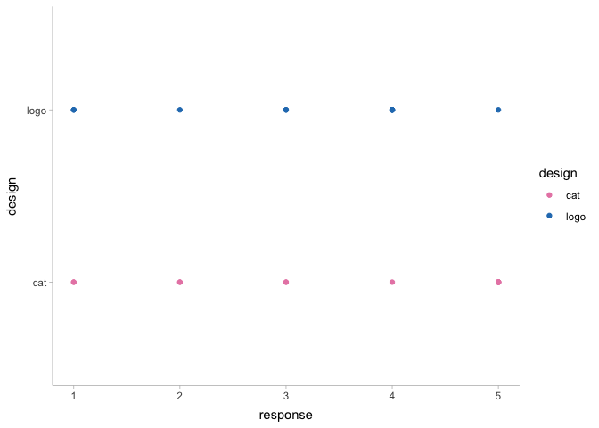
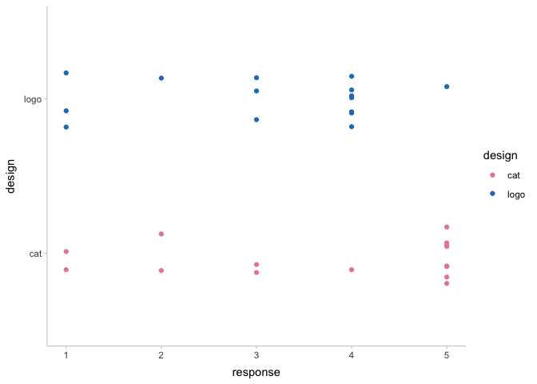
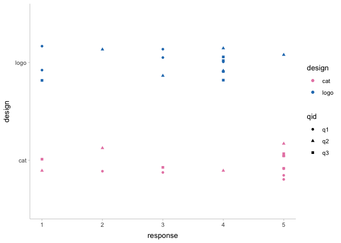
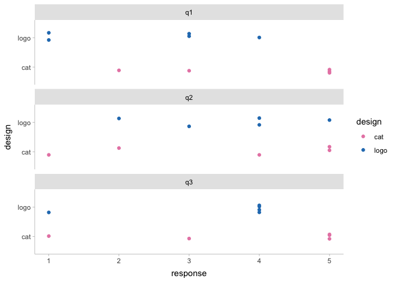
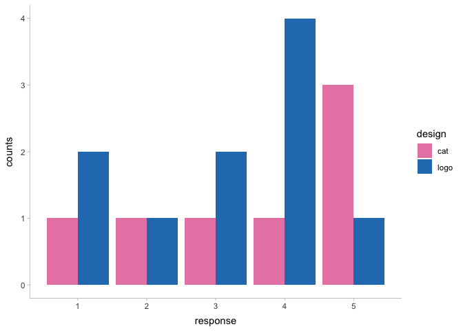
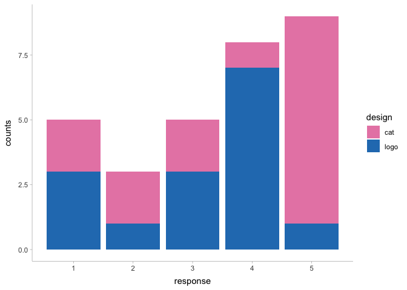
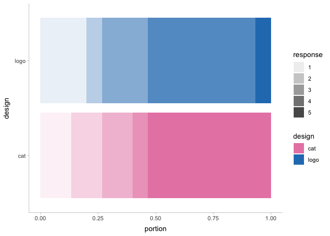
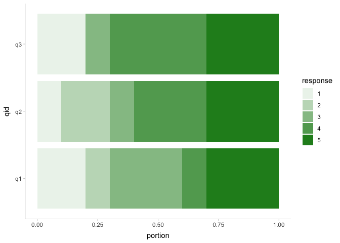

Visualizing the preference data
================
Fumeng Yang, Abhraneel Sarmar, Maryam Hedayati
September 30, 2023

This document provides the code for visualizing preference, Our research
question is people’s badge/button preference over two designs: `cat` and
`logo`. They are measured by three statements, each on a 5-point Likert
scale. The survey is at
<https://northwestern.az1.qualtrics.com/jfe/form/SV_1NqUXVkcvPvIKQm>.


# 1 Introduction

We first load packages

``` r
library(tidyverse, quietly = TRUE) # data manipulation
```

    ## ── Attaching packages ─────────────────────────────────────── tidyverse 1.3.2 ──
    ## ✔ ggplot2 3.4.2     ✔ purrr   1.0.1
    ## ✔ tibble  3.2.1     ✔ dplyr   1.1.2
    ## ✔ tidyr   1.3.0     ✔ stringr 1.5.0
    ## ✔ readr   2.1.2     ✔ forcats 0.5.1
    ## ── Conflicts ────────────────────────────────────────── tidyverse_conflicts() ──
    ## ✖ dplyr::filter() masks stats::filter()
    ## ✖ dplyr::lag()    masks stats::lag()

``` r
library(ggdist, quietly = TRUE) # uncertainty vis
# library(patchwork, quietly = TRUE) # if we need to put together a few plots 
```

We then load the data

``` r
df_raw <- read_csv('data/VIS23+tutorial_September+30,+2023_17.27.csv',
               col_names = TRUE, show_col_types = TRUE) %>% 
          # we keep who finished the survey and filter out those generated by preview 
          filter(Finished == 'True' & DistributionChannel == 'anonymous')
```

    ## Rows: 8 Columns: 23
    ## ── Column specification ────────────────────────────────────────────────────────
    ## Delimiter: ","
    ## chr (23): StartDate, EndDate, Status, IPAddress, Progress, Duration (in seco...
    ## 
    ## ℹ Use `spec()` to retrieve the full column specification for this data.
    ## ℹ Specify the column types or set `show_col_types = FALSE` to quiet this message.

Sanity check.

``` r
head(df_raw)
```

| StartDate           | EndDate             | Status     | IPAddress      | Progress | Duration (in seconds) | Finished | RecordedDate        | ResponseId        | RecipientLastName | RecipientFirstName | RecipientEmail | ExternalReference | LocationLatitude | LocationLongitude | DistributionChannel | UserLanguage | cat_1 | cat_2 | cat_3 | logo_1 | logo_2 | logo_3 |
|:--------------------|:--------------------|:-----------|:---------------|:---------|:----------------------|:---------|:--------------------|:------------------|:------------------|:-------------------|:---------------|:------------------|:-----------------|:------------------|:--------------------|:-------------|:------|:------|:------|:-------|:-------|:-------|
| 2023-09-30 16:31:01 | 2023-09-30 16:32:19 | IP Address | 24.13.82.129   | 100      | 78                    | True     | 2023-09-30 16:32:20 | R_YSsAkhpHYV03J29 | NA                | NA                 | NA             | NA                | 42.055           | -87.6951          | anonymous           | EN           | 5     | 5     | 5     | 3      | 4      | 4      |
| 2023-09-30 16:41:27 | 2023-09-30 16:42:07 | IP Address | 172.56.193.91  | 100      | 39                    | True     | 2023-09-30 16:42:07 | R_cDeyR5M2tc9sUtH | NA                | NA                 | NA             | NA                | 42.3562          | -71.0631          | anonymous           | EN           | 5     | 4     | 5     | 4      | 5      | 4      |
| 2023-09-30 16:32:22 | 2023-09-30 16:43:13 | IP Address | 24.13.82.129   | 100      | 650                   | True     | 2023-09-30 16:43:14 | R_3ERMySZd8lw9VN2 | NA                | NA                 | NA             | NA                | 42.055           | -87.6951          | anonymous           | EN           | 5     | 5     | 5     | 3      | 4      | 4      |
| 2023-09-30 16:42:38 | 2023-09-30 16:43:13 | IP Address | 104.28.39.32   | 100      | 34                    | True     | 2023-09-30 16:43:14 | R_3qW4ett4izNi6Xo | NA                | NA                 | NA             | NA                | 42.3562          | -71.0631          | anonymous           | EN           | 3     | 1     | 3     | 1      | 3      | 1      |
| 2023-09-30 16:53:08 | 2023-09-30 16:53:58 | IP Address | 172.59.186.181 | 100      | 49                    | True     | 2023-09-30 16:53:59 | R_3gO7gRkMgnnmPZI | NA                | NA                 | NA             | NA                | 41.8502          | -87.6736          | anonymous           | EN           | 2     | 2     | 1     | 1      | 2      | 4      |

Qualtrics usually gives lots of columns. Here we want `cat_1`, …,
`logo_3` and a participant column.

``` r
df = df_raw %>% 
  # select the columns we need
  select('cat_1':'logo_3') %>% 
  # add participantID
  mutate(participantID = paste0('P', row_number())) %>% 
  # move participantID to the first column
  relocate(participantID, .before = 1)
```

``` r
head(df)
```

| participantID | cat_1 | cat_2 | cat_3 | logo_1 | logo_2 | logo_3 |
|:--------------|:------|:------|:------|:-------|:-------|:-------|
| P1            | 5     | 5     | 5     | 3      | 4      | 4      |
| P2            | 5     | 4     | 5     | 4      | 5      | 4      |
| P3            | 5     | 5     | 5     | 3      | 4      | 4      |
| P4            | 3     | 1     | 3     | 1      | 3      | 1      |
| P5            | 2     | 2     | 1     | 1      | 2      | 4      |

Let’s continue transforming data into a more workable format.

``` r
df_long = df %>% 
  # move all responses into one column
  pivot_longer(cols = cat_1:logo_3, names_to = 'question', values_to = 'response') %>% 
  # split the questions into design and question id
  separate(question, sep = '_', into = c('design', 'qid')) %>% 
  mutate(design = as.factor(design), 
         qid = as.factor(paste0('q', qid)), 
         # transform responses into numeric format
         # this makes it easier for visualization
         # but this does not mean we consider them numeric responses!
         response = as.numeric(response))
```

The final data we will work with is

``` r
head(df_long)
```

| participantID | design | qid | response |
|:--------------|:-------|:----|---------:|
| P1            | cat    | q1  |        5 |
| P1            | cat    | q2  |        5 |
| P1            | cat    | q3  |        5 |
| P1            | logo   | q1  |        3 |
| P1            | logo   | q2  |        4 |
| P1            | logo   | q3  |        4 |

# 2 Visualization

We set up a global theme and color preference.

``` r
theme_set(theme_ggdist())

scale_color_vis23 = \(...) scale_color_manual(..., 
                                              values = c("cat" = '#e888b3', 
                                                         "logo" ='#277cbd'),
                                              aesthetics = c("color", "fill")
)
```

## 2.1 raw data

So if we juts plot raw data, they are going to overlap with each other

``` r
df_long %>% 
  ggplot(aes(x = response, y = design, color = design)) + 
  geom_point() +
  scale_color_vis23()
```

<!-- -->
One thing we can do is to add a bit of jitterinbg to move them away from
each other

``` r
df_long %>% 
  ggplot(aes(x = response, y = design, color = design)) + 
  # we don't want the responses to move around their scale
  # so we only jitter y axis
  # we add a seed to get the same layout everytime
  geom_point(position = position_jitter(width = 0, height = .2, seed = 1234)) +
  scale_color_vis23()
```

<!-- -->
We may also want to know different questions.

``` r
df_long %>% 
  ggplot(aes(x = response, y = design, color = design, shape = qid)) + 
  # we don't want the responses to move around their scale
  # so we only jitter y axis
  # we add a seed to get the same layout everytime
  geom_point(position = position_jitter(width = 0, height = .2, seed = 1234)) +
  scale_color_vis23()
```

<!-- -->

``` r
df_long %>% 
  ggplot(aes(x = response, y = design, color = design)) + 
  # we don't want the responses to move around their scale
  # so we only jitter y axis
  # we add a seed to get the same layout everytime
  geom_point(position = position_jitter(width = 0, height = .2, seed = 1234)) +
  facet_wrap(qid ~ ., ncol = 1) + 
  scale_color_vis23()
```

<!-- -->

## 2.2 portion & counts

Another way to think about the visualization is to show the counts or
the portion.

``` r
df_long %>% 
  group_by(design, qid, response) %>% 
  reframe(n = n()) %>% 
  ggplot(aes(x = response, y = n, fill = design)) + 
  geom_bar(position="dodge", stat="identity") +
  scale_color_vis23() +
  ylab('counts')
```

<!-- -->
We can also try a different layout.

``` r
df_long %>% 
  group_by(design, qid, response) %>% 
  reframe(n = n()) %>% 
  ggplot(aes(x = response, y = n, fill = design)) + 
  geom_bar(position="stack", stat="identity") +
  scale_color_vis23() +
  ylab('counts')
```

<!-- -->

We can also visualize them by portion. Different gradients mean
different responses.

``` r
df_long %>% 
  group_by(design, response) %>% 
  reframe(n = n()) %>% 
  ggplot(aes(x = design, fill = design, y = n, alpha = response)) + 
  geom_bar(position="fill", stat="identity") +
  ylab('portion') +
  scale_color_vis23() +
  coord_flip()
```

<!-- -->

Of course, we can also split them based on different questions. We can
also visualization different questions. However, remeber that our
research question is people’s preference. We would like to focus on this
research question first.

``` r
df_long %>% 
  group_by(qid, response) %>% 
  reframe(n = n()) %>% 
  ggplot(aes(x = qid,  y = n, alpha = response)) + 
  geom_bar(position="fill", stat="identity",  fill = 'forestgreen') +
  ylab('portion') +
  coord_flip()
```

<!-- -->

## 2.3 Aggregated data

# 3 Session Info

``` r
sessionInfo()
```

    ## R version 4.2.2 (2022-10-31)
    ## Platform: aarch64-apple-darwin20 (64-bit)
    ## Running under: macOS Ventura 13.2
    ## 
    ## Matrix products: default
    ## BLAS:   /Library/Frameworks/R.framework/Versions/4.2-arm64/Resources/lib/libRblas.0.dylib
    ## LAPACK: /Library/Frameworks/R.framework/Versions/4.2-arm64/Resources/lib/libRlapack.dylib
    ## 
    ## locale:
    ## [1] en_US.UTF-8/en_US.UTF-8/en_US.UTF-8/C/en_US.UTF-8/en_US.UTF-8
    ## 
    ## attached base packages:
    ## [1] stats     graphics  grDevices utils     datasets  methods   base     
    ## 
    ## other attached packages:
    ##  [1] ggdist_3.3.0    forcats_0.5.1   stringr_1.5.0   dplyr_1.1.2    
    ##  [5] purrr_1.0.1     readr_2.1.2     tidyr_1.3.0     tibble_3.2.1   
    ##  [9] ggplot2_3.4.2   tidyverse_1.3.2
    ## 
    ## loaded via a namespace (and not attached):
    ##  [1] lubridate_1.8.0      assertthat_0.2.1     digest_0.6.29       
    ##  [4] utf8_1.2.2           R6_2.5.1             cellranger_1.1.0    
    ##  [7] backports_1.4.1      reprex_2.0.1         evaluate_0.15       
    ## [10] highr_0.9            httr_1.4.3           pillar_1.9.0        
    ## [13] rlang_1.1.1          googlesheets4_1.0.0  readxl_1.4.0        
    ## [16] rstudioapi_0.13      rmarkdown_2.14       labeling_0.4.2      
    ## [19] googledrive_2.0.0    bit_4.0.4            munsell_0.5.0       
    ## [22] broom_1.0.0          compiler_4.2.2       modelr_0.1.8        
    ## [25] xfun_0.31            pkgconfig_2.0.3      htmltools_0.5.2     
    ## [28] tidyselect_1.2.0     fansi_1.0.3          crayon_1.5.1        
    ## [31] tzdb_0.3.0           dbplyr_2.2.0         withr_2.5.0         
    ## [34] grid_4.2.2           distributional_0.3.2 jsonlite_1.8.7      
    ## [37] gtable_0.3.0         lifecycle_1.0.3      DBI_1.1.2           
    ## [40] magrittr_2.0.3       scales_1.2.0         cli_3.4.1           
    ## [43] stringi_1.7.6        vroom_1.5.7          farver_2.1.1        
    ## [46] fs_1.5.2             xml2_1.3.3           ellipsis_0.3.2      
    ## [49] generics_0.1.3       vctrs_0.6.2          tools_4.2.2         
    ## [52] bit64_4.0.5          glue_1.6.2           hms_1.1.1           
    ## [55] parallel_4.2.2       fastmap_1.1.0        yaml_2.3.5          
    ## [58] colorspace_2.0-3     gargle_1.2.0         rvest_1.0.2         
    ## [61] knitr_1.39           haven_2.5.0
